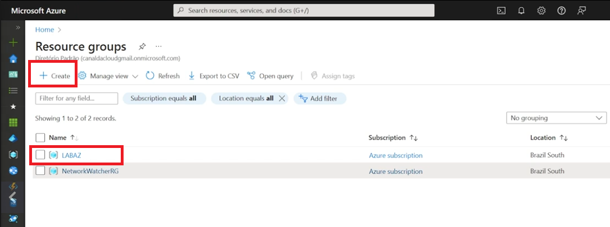
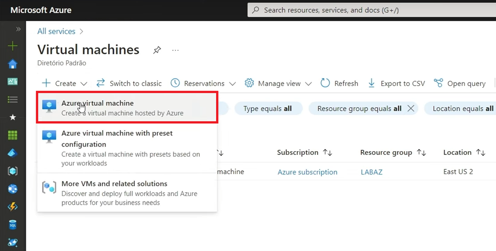
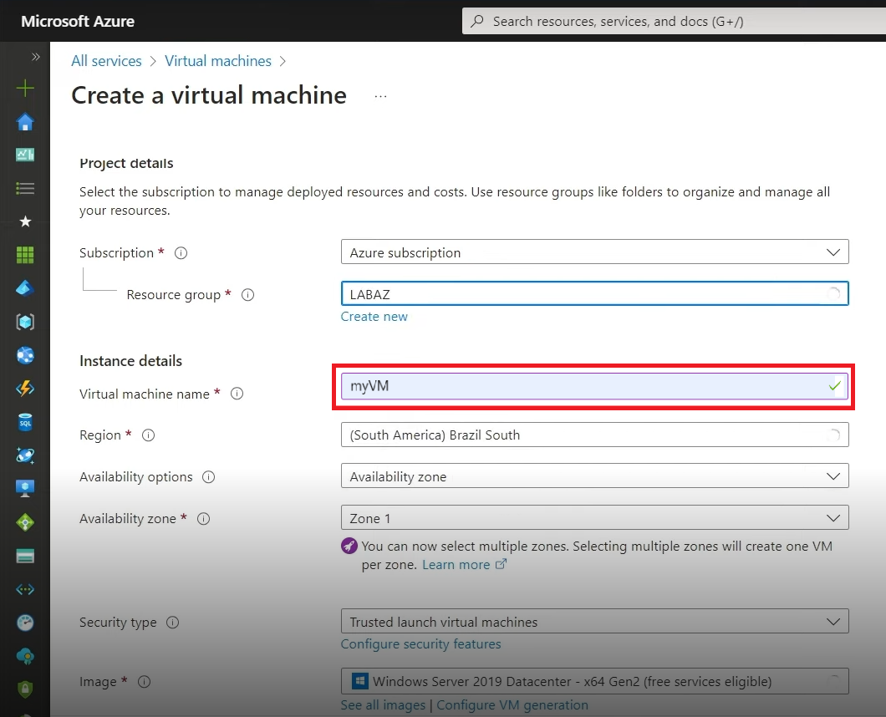

# 🌐 Laboratório de Máquinas Virtuais no Azure

Este repositório contém resumos, anotações, dicas e scripts utilizados no laboratório de criação e gerenciamento de máquinas virtuais no **Microsoft Azure**.

---

## 📌 Tópicos abordados

### 1. Criação de Grupo de Recursos



### 2. Criação de VM via Portal






### 3. Configuração de Rede e NSG


### 4. Acesso Remoto (RDP/SSH)


### 5. Monitoramento e Ajuste de Recursos


---

## 📘 Conteúdo do Repositório

- **/images** → prints de tela do laboratório  
- **/scripts** → exemplos de scripts usados em CLI/PowerShell  
- **/docs** → resumos e anotações complementares  

---

## 📚 Tópicos Estudados

- Criação de VMs no portal do Azure
- Configuração de rede e firewall (NSG)
- Acesso remoto via RDP/SSH
- Monitoramento e métricas
- Automação com CLI e PowerShell

---

## 🔎 Exemplo de Comando CLI

```bash
az vm create   --resource-group MeuGrupo-01   --name MinhaVM-01   --image UbuntuLTS   --admin-username azureuser   --generate-ssh-keys
```

